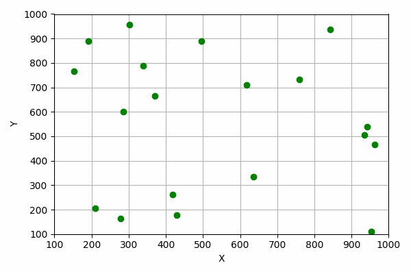

# Voronoi Diagram Computation with Fortune's Algorithm

Welcome to the Voronoi Diagram Computation project repository! This project implements Fortune's algorithm to compute Voronoi diagrams based on input points. The repository provides functionality to generate Voronoi diagrams, plot them, and generate random points for testing purposes.

## Introduction

Voronoi diagrams are essential in various fields, including computational geometry, geography, and computer graphics. This project presents an implementation of Fortune's algorithm, a popular method for computing Voronoi diagrams efficiently.
Here's a visual representation of the voronoi diagram for a set of 20 points.


## Usage

To utilize the Voronoi diagram computation and visualization functionalities, follow these steps:

1. **Compilation**: Compile,run and plot using the provided `Makefile` by running the command:
```shell
make
```
This will generate an image `output.png` representing the Voronoi diagram.
2. **Input Specification**: Prepare the input points in `input.txt`. First line contains number of points. Each following line should contain the x and y coordinates of a point separated by a space.
This will generate the Voronoi diagram and store its edges in `output.txt`
4. **Random Point Generation**: Optionally, you can generate a set of random points by running:
```bash
make random
```
Follow the prompts to specify the number of random points to generate. It then automaticallly runs the code and generates the plot.
**Note**: To see the algorithm working in its optimized `O(nlog(n))` time, consider the following:
- **Debugging Logs**: The project generates a `log.txt` file during execution, which contains debugging information. While building the project, this was used heavily for debugging purposes.It is almost a numerical simulation of the algorithm.However, if the code is run on a high number of points, it might run slow because of the generation of heavy debug output.Follow the commented instructions given in the main() function of voronoi.cpp to simply comment out the log generation code.

## Dependencies

The project relies on the following dependencies:

- C++ Compiler (e.g., g++)
- Python 3
- Matplotlib (for plotting, install via `pip install matplotlib`)

